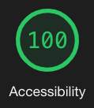

# Netflex

### Table of Contents
- [Netflex](#netflex)
    - [Table of Contents](#table-of-contents)
  - [Overview](#overview)
  - [Learning Goals](#learning-goals)
  - [Features](#features)
  - [Technologies Used](#technologies-used)
  - [Setup Instructions](#setup-instructions)
  - [Project Reflection](#project-reflection)
        - [Wins](#wins)
        - [Challenges](#challenges)
        - [Overall Impressions](#overall-impressions)
        - [Future Features](#future-features)
  - [Credits](#credits)
      - [Authors](#authors)
      - [Project Managers](#project-managers)
        - [2021/05/25](#20210525)

## Overview 

<table>
  <td>
    
  </td>
  <td>
    
  </td>
  <td>
    
  </td>
</table>

Not Netflix but Netflex, built within 60hrs while learning React, Router, Cypress, & GSAP. Used the provided API that was provided in the project [spec](https://frontend.turing.edu/projects/module-3/rancid-tomatillos-v3.html) to built an app from scratch. 
- GitHub Repo [LINK](https://github.com/asiisii/Netflex)
- Deployed [LINK](https://netflex-app.herokuapp.com/) 

## Learning Goals
- Gain competency with React fundamentals
- Create a multi-page UX using Router
- Use Cypress to test React components & asynchronous JS
- Display proper error handling based on the status code
- Write modular, reusable code that follows SRP 
- Implement responsive design for cross-screen compatibility
- Add extra features such animated transition, search functionality, embed trailer videos

## Features
When user visits the homepage, they will see a trending movie and movie posters of all the movies. When they click on a movie poster, they will see that specific movie's details. The user can search for a movie by title on the search bar/icon. 

When the movie's details page is displayed, user will have option to watch the trailer for that movie without leaving the movie's detail page. 

App is fully responsive for cross-screen compatibility

  
**[Back to top](#table-of-contents)**

## Technologies Used
- React
- Router
- Cypress
- HTML
- CSS 
- GSAP
- Webpack
- Github
- Heroku
  
## Setup Instructions
1. Clone this [repository](https://github.com/asiisii/Netflex)
2. `cd` into the repository in your terminal
3. `npm i` to install required dependencies 
4. Then `npm start` in your terminal to view it on your browser

## Project Reflection
##### Wins
- 100% score on Accessbility, SEO, & Best Practices (tested via Lighthouse)
- Implementing search funtionality, animated page transition, embed YouTube videos
- Fully responsive application
##### Challenges
- Implementing Router to create a multi-page UX
- Displaying the proper error depending on the status code
##### Overall Impressions
- Being able to easily refactor the app to implement Router, API data, & controlled form, helped to see the use of the virtual DOM, components resuability, and how easy it is to maintain components and data in React
##### Future Features
- Implement login/logout features
- Create Express microservice to store favorites
- Display movie informations for trending movie when clicked

## Credits
#### Authors
<table>
  <tr>
    <td> Ashish Malla <a href="https://github.com/asiisii">GH</td>
    <td> Jon Schlandt <a href="https://github.com/jon-schlandt">GH</td>
  </tr>
  <td>
    
  </td>  
  <td>
    
  </td>
</table>

#### Project Managers
<table>
  <tr>
    <td> Leta Keane <a href="https://github.com/letakeane">GH</td>
    <td> Scott Ertmer <a href="https://github.com/sertmer">GH</td>
  </tr>
  <td>
    
 </td>
  <td>
    
 </td>
</table>

**************************************************************************
This project was created for [Turing School of Software and Design](https://turing.io/)
##### 2021/05/25
**[Back to top](#table-of-contents)**